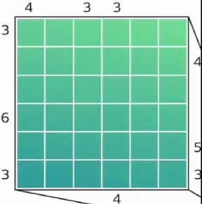

# Jane Street Academy Puzzle
This project was inspired by a fascinating puzzle shared by the Jane Street Academy of Math and Programming, which can be found [here](https://www.janestreet.com/amp24-puzzle/). 

## Puzzle instructions
Place a number between one and six in each square such that no number repeats in the same row or column. Each number represents a New York City skyscraper of the corresponding height. The numbers outside the grid indicate how many skyscrapers are visible in that direction. Note that taller skyscrapers block the view of shorter skyscrapers located behind them.

Once the cityscape is completed, trace the routes horizontally and vertically (but not diagonally) through adjacent skyscrapers to find a hidden message. A route may intersect with itself but not with any other route.

## My Programmatically Approach
I decided to tackle this puzzle programmatically as a practice to enhance my problem-solving and coding skills. I employed a backtracking algorithm with some optimization techniques to efficiently solve the puzzle. The entire solution is implemented in a Jupyter Notebook, leveraging the numpy library for array manipulations and optimizations.

Here's a brief overview of some of my insights:

- Smart Starts: I first look for clues that make some moves obvious (like when a row or column that can only be in one particular order)

- Flexible Filling: Depending on the clues, I choose the best orientation for filling the grid either row by row or column by column 

- Unique and Visible: As I fill in the grid, I make sure each skyscraper fits uniquely in its place while keeping in line with what's "visible" according to the clues

- Backtracking: It is a process of trial and error while ensuring each step respects the rules

## My Reasoning Approach
Below is a GIF illustrating my reasoning process. I didn't include an explanation to leave it as a fun exercise for reader to reason



## Final note
The following sequences represent the routes to be traced:
```
256215
26123546
425456
54643163
5632314
```
In the spirit of discovery, I've chosen not to disclose the secret message. I encourage you to solve the puzzle and find the message yourself!

